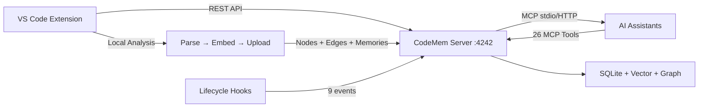

# CodeMem Team — VS Code Extension

[](LICENSE)
[](https://code.visualstudio.com/)

Shared persistent memory for AI coding assistants — team edition. A VS Code extension that connects to the [CodeMem Server v2](https://github.com/ADHIL007/codemem-server-v2), giving your team a shared knowledge graph that AI assistants can query across sessions.

> **Credits**: This project is forked from [cogniplex/codemem](https://github.com/cogniplex/codemem). The server has been enhanced and maintained at [ADHIL007/codemem-server-v2](https://github.com/ADHIL007/codemem-server-v2) with performance improvements (centrality skip during bulk ingest, dangling-edge tolerance, server-side logging), Copilot on-save hooks, and incremental edge-hash dedup.

---

## What's New in v0.2.0

### Server-Side Changes (codemem-server-v2)

| Change | Impact |
|--------|--------|
| **Centrality recompute removed from bulk ingest** | Fixed 504 gateway timeouts — each 50-edge chunk now completes in 30-600ms instead of 100s+ |
| **Dangling edge tolerance** | `from_storage` no longer crashes when an edge references a missing node — skips with a warning |
| **Server-side timing logs** | Every ingest request logs elapsed time per phase (nodes stored, edges stored, graph lock, total) |
| **`Tests` RelationshipType added** | TESTS edges from the extension no longer cause 404 parse errors |
| **`infer_node_kind` improved** | Correctly handles `sym:`, `endpoint:`, `author:` prefixes and sub-kinds (`:class:`, `:function:`, `:method:`, etc.) |

### Extension Changes

| Change | Impact |
|--------|--------|
| **Copilot on-save hook** | Every file save re-parses and uploads that file's edges automatically — no manual re-analysis needed |
| **Edge-hash dedup** | Analysis skips upload entirely when edges haven't changed since last run |
| **No-change short-circuit** | If zero files changed, analysis exits instantly with "Indexing up to date" |
| **Setup wizard persistence** | Completed steps survive VS Code restarts — wizard won't re-appear when server is temporarily offline |
| **Step detection improvements** | Step 1 no longer requires `.claude/`; Step 2 matches by namespace/path/name; Step 3 uses normalized paths |
| **Status bar: "indexing up to date"** | Shows `✓ CodeMem: indexing up to date` when all 3 setup steps are complete |
| **Copilot behavioral instructions** | `copilot-instructions.md` now includes "always do" rules (recall at session start, check blast radius before changes, store decisions) |
| **Upload reliability fixes** | Fixed double-slash URL bug, increased timeout to 120s, chunk size reduced to 50, file-based upload logging |
| **`copilotHookIndexing` setting** | New setting (default: `true`) to enable/disable the on-save hook |

### Updated Setup Steps

The 3-step onboarding wizard now detects state more reliably:

| Step | How Completion Is Detected |
|------|---------------------------|
| **1. Initialize Workspace** | `.mcp.json` exists with a `codemem` entry (`.claude/` no longer required — supports Copilot-only workspaces) |
| **2. Register Repository** | Server namespace matches configured `codemem.namespace` setting, workspace folder name, or registered repo path |
| **3. Analyze Workspace** | Analysis cache exists with >0 files for this workspace |

If the server is unreachable during startup, Step 2 preserves its previous state instead of flipping to incomplete.

---

## The Problem

AI assistants forget everything between sessions. Your team's Claude, Copilot, or Cursor instances each re-explore the same codebase independently — duplicating effort, missing context, and making decisions without historical awareness.

**CodeMem Team** solves this by connecting every team member's editor to a shared memory server. One developer's architectural discovery becomes everyone's context. The assistant picks up exactly where it left off — with full access to 26 MCP tools for memory, graph traversal, code search, and temporal queries.

---

## Features

### MCP Integration (Model Context Protocol)

- **Auto-configure `.mcp.json`** — Detects whether `codemem` CLI is available and registers the MCP server (stdio or HTTP) automatically
- **26 MCP tools exposed** — Memory CRUD, graph traversal, code search, symbol info, pattern detection, consolidation, namespace management, and session context
- **Dual transport modes** — `stdio` (local codemem process) or `HTTP` (remote team server at `/mcp`)
- **Multi-assistant support** — Detects and configures Claude Code, Cursor, Windsurf, and GitHub Copilot

### One-Command Initialization

Run `CodeMem: Initialize Workspace` and the extension:

1. **Detects AI assistants** — Finds Claude Code, Cursor, Windsurf, GitHub Copilot
2. **Installs 9 lifecycle hooks** — SessionStart, UserPromptSubmit, PostToolUse, PostToolUseFailure, Stop, SubagentStart, SubagentStop, SessionEnd, PreCompact
3. **Configures permissions** — Adds `mcp__codemem__*` to the Claude Code allow list
4. **Installs agent definitions** — Code-mapper team agents (`code-mapper`, `baseline-scanner`, `symbol-analyst`) for deep codebase analysis
5. **Installs codemem skill** — Tool reference guide for the AI assistant
6. **Sets up Copilot instructions** — Creates `.github/copilot-instructions.md` with codemem context
7. **Writes `.mcp.json`** — Registers the MCP server with auto-detected transport
8. **Verifies server connection** — Confirms the server is reachable
9. **Auto-init on connect** — If workspace is registered on server but not initialized locally, prompts to set up

### Workspace Analysis

- **Local-first analysis** — Parses symbols, builds edges (IMPORTS, CALLS, CONTAINS, INHERITS, IMPLEMENTS, HTTP_CALLS, TESTS, CO_CHANGED, MODIFIED_BY)
- **Pluggable embeddings** — NVIDIA NIM, OpenAI, Ollama (local), or any OpenAI-compatible endpoint
- **Incremental (git-aware)** — Only re-analyzes files modified since last run using mtime + size cache
- **Auto-analyze on save** — Optional file watcher with 3-second debounce triggers incremental re-analysis
- **Force full rebuild** — Wipe cache and re-analyze everything from scratch
- **Quality reports** — Complexity metrics and code smell detection per file
- **Auto-generated memories** — Extracts decisions, patterns, and insights from code structure
- **.gitignore aware** — Respects both settings-based ignore patterns and `.gitignore`

### Code-Mapper Agent Team

The `codemem.init` command installs specialized Claude Code agents:

| Agent | Role |
|-------|------|
| `code-mapper` | Team lead — orchestrates analysis, delegates to specialists |
| `baseline-scanner` | Wave 1 — creates foundational memories per file and package |
| `symbol-analyst` | Wave 2 — deep analysis of critical symbols with decision/pattern memories |

Run with: `claude --agent code-mapper`

### Shared Memory Server

- **Team-wide knowledge graph** — All team members' AI assistants share context
- **Namespace isolation** — Each workspace gets its own namespace (configurable)
- **Session tracking** — View past AI sessions with summaries and memory counts
- **Server stats** — Memory count, embeddings, graph nodes/edges, sessions, namespaces

### Doctor — Health Check

One-click diagnostic that validates:

1. Server reachable
2. Database accessible (shows memory/node/edge counts)
3. MCP endpoint responding (POST to `/mcp`)
4. Embedding API functional (sends test embedding request)
5. Workspace folder open

### Sidebar Views

- **Memories** — Browse, search, paginate, delete, copy content/ID. Supports inline actions and context menus
- **Sessions** — View past sessions with memory counts and summaries
- **Doctor Results** — Check results displayed inline after running Doctor

### Editor Integration

- **Right-click → Store Selection** — Save highlighted code as a typed memory (decision, pattern, preference, style, habit, insight, context)
- **Store Clipboard** — Store clipboard content as a memory
- **Status bar** — Connection state indicator (connecting/connected/disconnected)

---

## Quick Start

### 1. Install the Extension

Install from the VS Code marketplace or build from source.

### 2. Start a CodeMem Server

```bash
# Clone and build the server
git clone https://github.com/ADHIL007/codemem-server-v2.git
cd codemem-server-v2
cargo install --path crates/codemem

# Start the API server
codemem serve --api --http --port 4242
```

The extension auto-connects to `http://localhost:4242` on startup. If the server isn't available, it offers "Configure URL" or "Start Server" (opens terminal with `codemem serve --api`).

### 3. Initialize Your Workspace

Open the Command Palette (`Ctrl+Shift+P`) and run:

```
CodeMem: Initialize Workspace
```

This performs full setup: lifecycle hooks, MCP server registration, agent definitions, skill installation, and Copilot instructions — all in one command.

### 4. Analyze Your Codebase

```
CodeMem: Analyze Workspace
```

Indexes your codebase locally — parses symbols, builds edges, computes embeddings, and uploads the results to the shared server. Prompts for embedding provider on first run.

### 5. Run Deep Analysis (Optional)

After the initial workspace analysis, run the code-mapper agent for team-based deep analysis:

```bash
claude --agent code-mapper
```

This spawns specialized agents that traverse the knowledge graph, discover patterns, and store architectural insights.

---

## MCP Tools Available

26 tools organized by category, accessible to any MCP-compatible AI assistant:

| Category | Tools |
|----------|-------|
| Memory CRUD (7) | `store_memory`, `recall`, `delete_memory`, `associate_memories`, `refine_memory`, `split_memory`, `merge_memories` |
| Graph & Structure (9) | `graph_traverse`, `summary_tree`, `codemem_status`, `search_code`, `get_symbol_info`, `get_symbol_graph`, `find_important_nodes`, `find_related_groups`, `get_cross_repo` |
| Node Analysis (2) | `get_node_memories`, `node_coverage` |
| Consolidation & Patterns (3) | `consolidate`, `detect_patterns`, `get_decision_chain` |
| Namespace (3) | `list_namespaces`, `namespace_stats`, `delete_namespace` |
| Session & Context (2) | `session_checkpoint`, `session_context` |

---

## Lifecycle Hooks

Automatically installed during `codemem.init`:

| Hook | Command | Purpose |
|------|---------|---------|
| `SessionStart` | `codemem mcp context` | Inject prior knowledge at session start |
| `UserPromptSubmit` | `codemem mcp prompt` | Capture user prompts |
| `PostToolUse` | `codemem mcp ingest` | Capture edits (Edit/Write/MultiEdit) |
| `PostToolUseFailure` | `codemem mcp tool-error` | Track errors for learning |
| `Stop` | `codemem mcp summarize` | Generate session summary |
| `SubagentStart` | `codemem mcp agent-start` | Track sub-agent spawns |
| `SubagentStop` | `codemem mcp agent-result` | Capture sub-agent results |
| `SessionEnd` | `codemem mcp session-close` | Clean session close |
| `PreCompact` | `codemem mcp checkpoint` | Checkpoint before compaction |

---

## Commands

| Command | Description |
|---------|-------------|
| `CodeMem: Initialize Workspace` | Full setup: hooks, MCP, agents, skills, permissions |
| `CodeMem: Connect to Server` | Connect/reconnect to the CodeMem server |
| `CodeMem: Analyze Workspace` | Full local analysis with embedding |
| `CodeMem: Reanalyze Changed Files Only` | Incremental analysis (git-aware) |
| `CodeMem: Force Full Rebuild` | Wipe cache and re-analyze everything |
| `CodeMem: Search Memories` | Semantic search across stored memories |
| `CodeMem: Store Selection as Memory` | Store highlighted code as a memory |
| `CodeMem: Store Clipboard as Memory` | Store clipboard content as a memory |
| `CodeMem: Register Repository` | Register current repo on the server |
| `CodeMem: Analyze Repository` | Trigger local analysis |
| `CodeMem: List Repositories` | Show registered repositories |
| `CodeMem: Configure Team MCP Server` | Write `.mcp.json` with transport mode picker |
| `CodeMem: Open Web UI` | Open the CodeMem control plane UI |
| `CodeMem: Show Server Stats` | Display memory/graph/session counts |
| `CodeMem: Doctor` | Health check for server, DB, MCP, embeddings |

---

## Configuration

All settings are under the `codemem.*` prefix in VS Code settings.

| Setting | Default | Description |
|---------|---------|-------------|
| `codemem.serverUrl` | `http://localhost:4242` | URL of the shared CodeMem server |
| `codemem.namespace` | *(workspace name)* | Memory namespace for this workspace |
| `codemem.autoConnect` | `true` | Auto-connect on startup |
| `codemem.analysisMode` | `local-only` | Where analysis runs: `local-only`, `hybrid`, or `server` |
| `codemem.copilotHookIndexing` | `true` | **NEW** — Re-index file edges on every save (lightweight Copilot PostToolUse equivalent) |
| `codemem.embeddingProvider` | *(prompt on first use)* | Embedding provider: `nvidia-nim`, `openai`, `ollama`, or skip |
| `codemem.embeddingApiKey` | | API key for the embedding provider |
| `codemem.embeddingUrl` | *(from preset)* | Embedding API base URL |
| `codemem.embeddingModel` | *(from preset)* | Embedding model name |
| `codemem.chunkSize` | `60` | Lines per chunk during analysis |
| `codemem.ignorePatterns` | `[node_modules, .git, dist, ...]` | Globs to exclude from analysis |
| `codemem.autoAnalyzeOnSave` | `false` | Full re-analysis on file changes (heavy — prefer `copilotHookIndexing`) |
| `codemem.memoriesPerPage` | `50` | Memories loaded per page in sidebar |

### Embedding Providers

| Provider | Model | Dimensions | Notes |
|----------|-------|-----------|-------|
| `nvidia-nim` | `nvidia/nv-embed-v1` | 4096 | Requires API key |
| `openai` | `text-embedding-3-small` | 1536 | Requires API key |
| `ollama` | `nomic-embed-text` | 768 | Local, no API key needed |
| `custom` | *(configurable)* | *(configurable)* | Any OpenAI-compatible endpoint |

On first analysis, the extension prompts you to select a provider if not configured. Choose "Skip embedding" for graph-only analysis without vectors.

---

## Architecture



The extension operates in **local-only** mode by default:

1. **Parses** your workspace — extracts symbols (functions, classes, methods, interfaces, types, constants, endpoints, tests) and edges (imports, calls, contains, inherits, implements, HTTP calls, co-changed, modified-by)
2. **Embeds** code chunks using your configured provider
3. **Uploads** extracted nodes, edges, and memories to the shared server
4. **Configures MCP** so AI assistants can query the shared knowledge graph via 26 tools
5. **Installs hooks** so assistant activity is passively captured across sessions

### Supported Languages for Analysis

TypeScript, JavaScript (JSX/TSX/MJS/CJS), Python, Rust, Go, Java, C#, C/C++, Ruby, PHP, Vue, Svelte, Markdown.

### Edge Types

| Edge | Description |
|------|-------------|
| `IMPORTS` | Module/file import relationships |
| `CALLS` | Function/method call chains |
| `CONTAINS` | File contains symbol, module contains class |
| `INHERITS` | Class inheritance |
| `IMPLEMENTS` | Interface implementation |
| `READS` / `WRITES` | Variable access patterns |
| `CO_CHANGED` | Files frequently modified together (git history) |
| `MODIFIED_BY` | Commit → file modification edges |
| `HTTP_CALLS` | REST API call relationships |
| `TESTS` | Test → implementation mapping |

---

## AI Assistant Integrations

CodeMem Team auto-detects and configures multiple AI coding assistants during initialization.

### Claude Code

The deepest integration — full lifecycle capture and MCP tool access.

| What's configured | Location | Purpose |
|-------------------|----------|---------|
| 9 lifecycle hooks | `.claude/settings.json` | Passive capture of reads, edits, errors, sessions |
| MCP permissions | `.claude/settings.json` | `mcp__codemem__*` auto-allowed |
| Agent definitions | `.claude/agents/` | Code-mapper team for deep analysis |
| Codemem skill | `.claude/skills/codemem/SKILL.md` | Tool reference guide (32 tools) |
| MCP server | `.mcp.json` | stdio or HTTP transport |

**Lifecycle hooks installed:**
- `SessionStart` → injects prior context so Claude picks up where it left off
- `UserPromptSubmit` → captures prompts for session continuity
- `PostToolUse` → captures file edits (Edit/Write/MultiEdit)
- `PostToolUseFailure` → tracks errors for learning
- `Stop` → generates session summary
- `SubagentStart/Stop` → tracks sub-agent work
- `SessionEnd` → clean session close
- `PreCompact` → checkpoints before context compaction

**Code-mapper agents:**

After init, run `claude --agent code-mapper` to spawn a team of specialized agents that traverse the knowledge graph and store architectural insights:

```
code-mapper        → Team lead: orchestrates analysis
baseline-scanner   → Wave 1: file-level context memories
symbol-analyst     → Wave 2: deep symbol analysis
```

### GitHub Copilot

| What's configured | Location | Purpose |
|-------------------|----------|---------|
| Instructions file | `.github/copilot-instructions.md` | Full MCP tool reference + best practices |
| MCP server | `.mcp.json` | Access to 26 MCP tools |

The Copilot instructions include:
- Complete reference for all MCP tools with parameters
- Best practices (recall before solving, store decisions, check blast radius)
- Guidance on linking memories to code nodes (`sym:Name`, `file:path`)

### Cursor

| What's configured | Location | Purpose |
|-------------------|----------|---------|
| MCP server | `.mcp.json` | Access to 26 MCP tools |
| Detection | `~/.cursor/` | Auto-detected during init |

Cursor reads `.mcp.json` for MCP server configuration. All 26 codemem tools are available directly in Cursor's AI chat.

### Windsurf

| What's configured | Location | Purpose |
|-------------------|----------|---------|
| MCP server | `.mcp.json` | Access to 26 MCP tools |
| Detection | `~/.windsurf/` | Auto-detected during init |

Windsurf reads `.mcp.json` for MCP server configuration, providing full access to memory recall, graph traversal, and code search tools.

### MCP Transport Modes

The extension supports two MCP transport modes, configurable via `CodeMem: Configure Team MCP Server`:

| Mode | Config | Use case |
|------|--------|----------|
| **stdio** | `{ "command": "codemem", "args": ["mcp", "serve"] }` | Local development — requires `codemem` CLI in PATH |
| **HTTP** | `{ "type": "http", "url": "http://server:4242/mcp" }` | Team deployment — shared remote server |

Auto-detection logic:
- If `codemem` CLI is in PATH → stdio mode (local, fastest)
- If CLI not found → HTTP mode (connects to configured `serverUrl`)

### Best Practices for AI Assistants

The installed skill/instructions teach assistants to:

1. **Start of session** — `recall` existing memories before solving problems
2. **Architecture decisions** — `store_memory` with type `"decision"`, importance ≥ 0.8
3. **Discovered patterns** — `store_memory` with type `"pattern"`, linked to graph nodes
4. **Before changes** — `get_symbol_graph` direction `"incoming"` to check blast radius
5. **Code understanding** — `search_code` (semantic) + `get_symbol_graph` for dependency chains
6. **After refactors** — `consolidate` mode `"cluster"` to deduplicate stale memories
7. **Always link** — Pass `links: ["sym:FunctionName", "file:path/to/file"]` for better retrieval

---

## Team Workflow

1. **Set up a shared server** — Deploy `codemem serve --api` on a team-accessible host
2. **Point all editors** — Each developer sets `codemem.serverUrl` to the team server
3. **Initialize once** — Run `CodeMem: Initialize Workspace` per project
4. **Analyze the codebase** — Initial analysis uploads the knowledge graph
5. **AI assistants share context** — Decisions, patterns, and insights persist across all team members' sessions
6. **Incremental updates** — Changed files are re-analyzed on save (optional) or on-demand
7. **Deep analysis** — Run `claude --agent code-mapper` for comprehensive architectural mapping

---

## Files Created by Init

```
.mcp.json                              # MCP server registration
.claude/
  settings.json                        # Hooks, permissions
  agents/
    code-mapper.md                     # Team lead agent
    baseline-scanner.md                # Wave 1 file scanner
    symbol-analyst.md                  # Wave 2 symbol analyzer
  skills/
    codemem/
      SKILL.md                         # Tool reference for AI
.github/
  copilot-instructions.md             # Copilot context (if detected)
```

---

## Building from Source

```bash
git clone https://github.com/ADHIL007/codemem-vscode.git
cd codemem-vscode
npm install
npm run compile
```

Then press `F5` in VS Code to launch the Extension Development Host.

---

## Related Repositories

| Repository | Description |
|------------|-------------|
| [ADHIL007/codemem-server-v2](https://github.com/ADHIL007/codemem-server-v2) | The enhanced CodeMem server (Rust) — forked from cogniplex/codemem |
| [ADHIL007/codemem-vscode](https://github.com/ADHIL007/codemem-vscode) | This VS Code extension |
| [cogniplex/codemem](https://github.com/ADHIL007/codemem) | Original upstream project |

---

## Requirements

- VS Code ≥ 1.80.0
- A running [CodeMem](https://github.com/ADHIL007/codemem-server-v2) server (`codemem serve --api`)
- *(Optional)* `codemem` CLI in PATH — enables stdio MCP transport and lifecycle hooks
- *(Optional)* An embedding provider API key (for `nvidia-nim` or `openai`), or a local Ollama instance

---

## License

[Apache 2.0](LICENSE)
